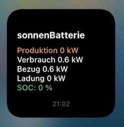

#### scriptable.sonnenBatterie V1.0


# sonnenBatterie-Widget
Widget für die sonnenBatterien EC8.0/SB10

Download: [(SonnenBatterie V1.0.js)] (/SonnenBatterie V1.0.js)

ZIP-Datei [(Download hier)](/QuickAppCode/SB-Adapter01_V1.1.fqa.zip) 

## Kurzbeschreibung
Das Widget für die sonnenBatterie liest ausgewählte Betriebsdaten der sonnenBatterie über deren API-Schnittstelle aus und stellt diese in einer Übersicht zur Verfügung. Das Script läuft mit Unterstützung der App **Scriptable** auf dem iPhone mit **iOS14**.

## Settings, Parameter
Im Script ist in der oberen Zeile die gültige URL der sonnenBatterie einzugeben, über die die Batterie im LAN zu erreichen ist.

**APIurl:** - IP-Adresse der sonnenBatterie in der Form 999:999:999:99

## API-Schnittstelle

````APIurl ="http://xxx.xxx.xxx.xx:8080/api/v1/status"````

Die ausgelesenen Daten werden zur Anzeige gebracht, eine Speicherung der Daten, bspw. in einer Datenbank, erfolgt nicht.

Die folgenden JSON-Daten der Batterie werden verarbeitet:

##### JSON

````
{
...,
"Consumption_W":358,
...,
"GridFeedIn_W":5065,
...,
"Pac_total_W":-1031,
"Production_W":6458,
"USOC":58,
...
}
````
## Changelog

2020/11/11: sonnenBatterie V1.0 (Widget)
